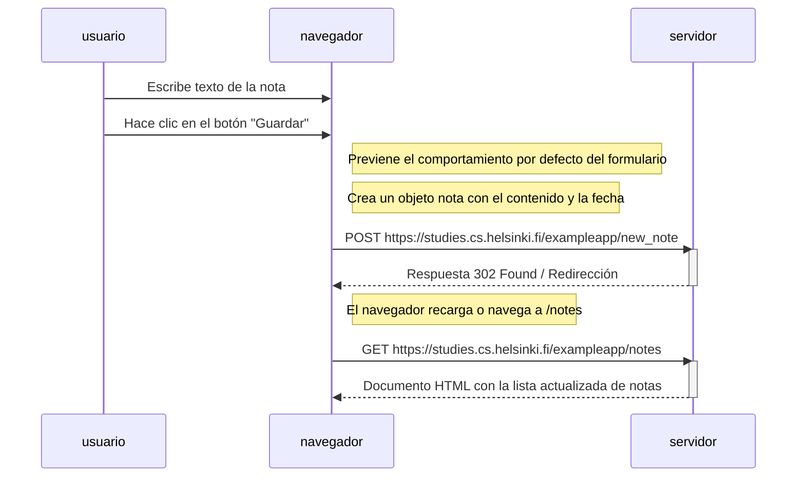

```mermaid
sequenceDiagram
    participant usuario
    participant navegador
    participant servidor

    usuario->>navegador: Escribe texto de la nota
    usuario->>navegador: Hace clic en el botón "Guardar"

    Note right of navegador: Previene el comportamiento por defecto del formulario
    Note right of navegador: Crea un objeto nota con el contenido y la fecha

    navegador->>servidor: POST https://studies.cs.helsinki.fi/exampleapp/new_note
    activate servidor
    servidor-->>navegador: Respuesta 302 Found / Redirección
    deactivate servidor

    Note right of navegador: El navegador recarga o navega a /notes

    navegador->>servidor: GET https://studies.cs.helsinki.fi/exampleapp/notes
    activate servidor
    servidor-->>navegador: Documento HTML con la lista actualizada de notas
    deactivate servidor
```
