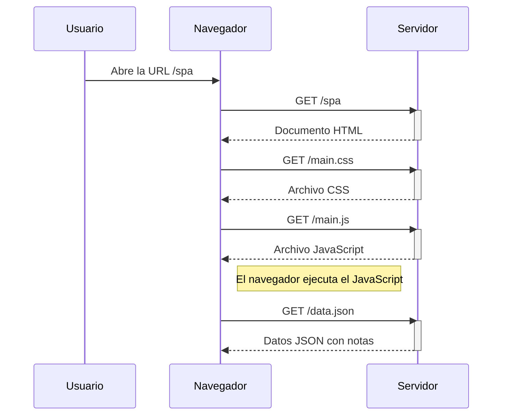

```mermaid
sequenceDiagram
    participant Usuario
    participant Navegador
    participant Servidor

    Usuario->>Navegador: Abre la URL /spa

    Navegador->>Servidor: GET /spa
    activate Servidor
    Servidor-->>Navegador: Documento HTML
    deactivate Servidor

    Navegador->>Servidor: GET /main.css
    activate Servidor
    Servidor-->>Navegador: Archivo CSS
    deactivate Servidor

    Navegador->>Servidor: GET /main.js
    activate Servidor
    Servidor-->>Navegador: Archivo JavaScript
    deactivate Servidor

    Note right of Navegador: El navegador ejecuta el JavaScript

    Navegador->>Servidor: GET /data.json
    activate Servidor
    Servidor-->>Navegador: Datos JSON con notas
    deactivate Servidor
```
