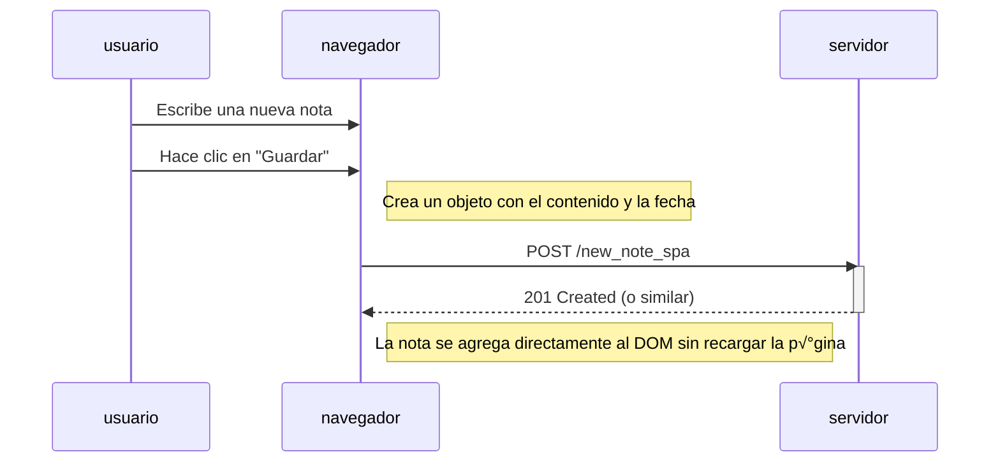

```mermaid
sequenceDiagram
    participant usuario
    participant navegador
    participant servidor

    usuario->>navegador: Escribe una nueva nota
    usuario->>navegador: Hace clic en "Guardar"

    Note right of navegador: Crea un objeto con el contenido y la fecha

    navegador->>servidor: POST /new_note_spa
    activate servidor
    servidor-->>navegador: 201 Created (o similar)
    deactivate servidor

    Note right of navegador: La nota se agrega directamente al DOM sin recargar la p√°gina
```
